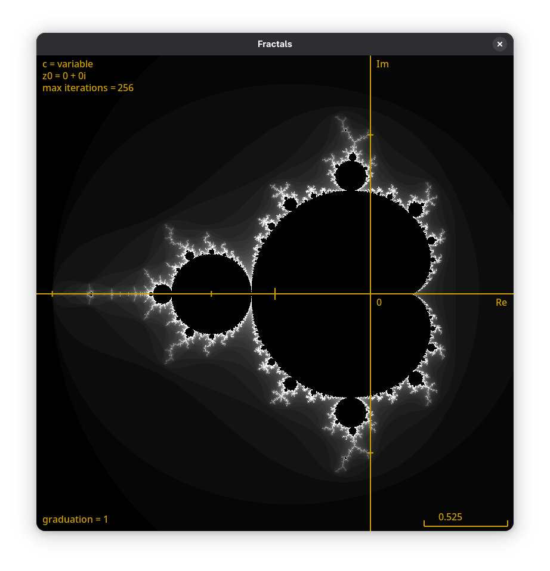
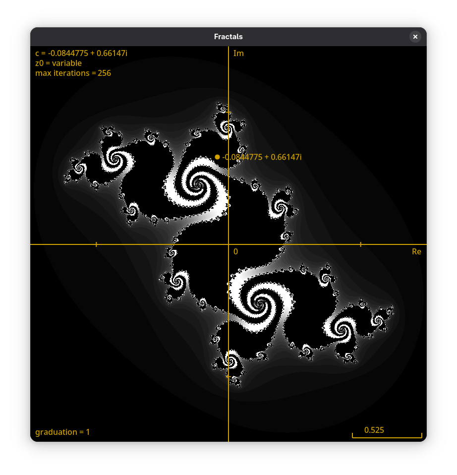
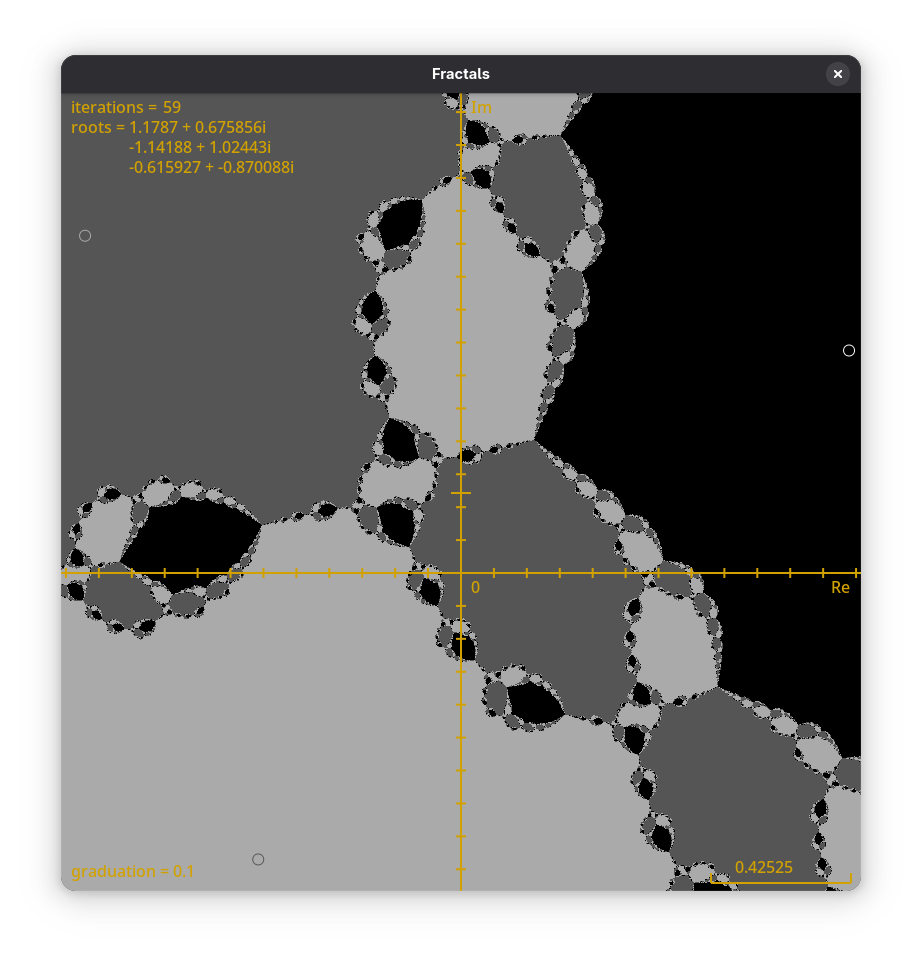

# Lightweight GTK Fractal Explorer

Explore and visualize Mandelbrot, Julia, and Newton fractals with a lightweight GTK application written in C.

## Demo

### Mandelbrot Fractal


### Julia Fractal


### Newton Fractal


## Setup

- Install `gcc` and `make`.

## Usage

```sh
BUILD_TYPE=release make # Compile the code in release mode (default)
BUILD_TYPE=dev make # Compile the code in development mode (includes address sanitizer and debug symbols)

make run # Run the compiled main.out
```

## Controls

### General

| Keys | Description |
| - | - |
|`Up`, `Down`, `Left`, `Right` | Move the view 10% towards this direction |
| `+`/`=`, `-` | Zoom in / out the view |
| `q` | Quit the application |
| `j` | Toggle between the different fractals (Mandelbrot, Julia, Newton) |
| `h` | Reset the view, the number of iterations, and the settings of the current fractal |
| `o` | Toggle showing the overlays |
| `i`, `I` | Increment / Decrement the number of iterations

### Julia Fractal

| Keys | Description |
| - | - |
| `w`, `a`, `s`, `d` | Move $z_0$ 0.1 complex units towards this direction |
| `Mouse Drag` | Move $z_0$ using the mouse |


## Development

To get proper autocompletion for `clangd`, you need to generate a `compile_commands.json` file. This can be done using the `bear` tool.
```
bear -- make clean all
```
## License

This project is licensed under the [GPL-3.0 License](./LICENSE)